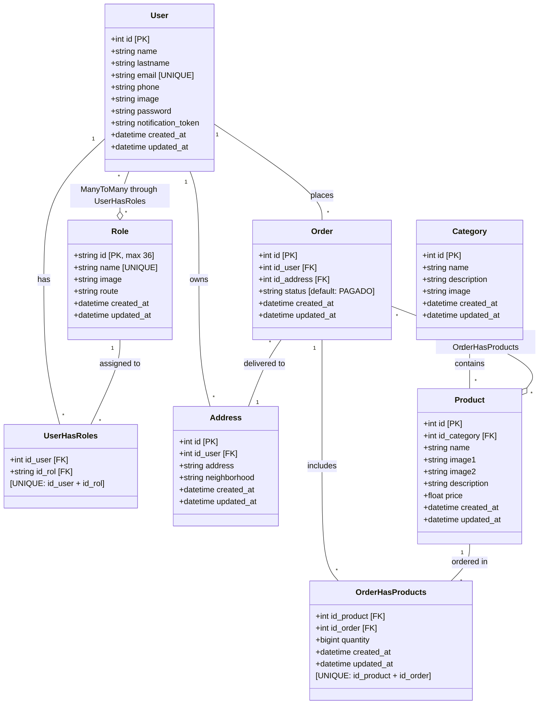

# Django E-Commerce Project - Class Diagram

## Database Structure Overview

This Django project implements an e-commerce system with the following models and relationships:

---

## Class Diagram (Mermaid)



---

## Relationships Explained

### 1. **User ↔ Role** (Many-to-Many)
- **Through Table**: `UserHasRoles`
- **Description**: Users can have multiple roles, and each role can be assigned to multiple users
- **Constraint**: Unique combination of (id_user, id_rol)

### 2. **User → Address** (One-to-Many)
- **Relationship**: One user can have multiple addresses
- **Foreign Key**: `Address.id_user` references `User.id`
- **Cascade**: Delete addresses when user is deleted

### 3. **User → Order** (One-to-Many)
- **Relationship**: One user can place multiple orders
- **Foreign Key**: `Order.id_user` references `User.id`
- **Cascade**: Delete orders when user is deleted

### 4. **Category → Product** (One-to-Many)
- **Relationship**: One category can contain multiple products
- **Foreign Key**: `Product.id_category` references `Category.id`
- **Cascade**: Delete products when category is deleted

### 5. **Order ↔ Product** (Many-to-Many)
- **Through Table**: `OrderHasProducts`
- **Description**: Orders can contain multiple products, and products can appear in multiple orders
- **Additional Field**: `quantity` (number of items ordered)
- **Constraint**: Unique combination of (id_product, id_order)

### 6. **Order → Address** (Many-to-One)
- **Relationship**: Each order is delivered to one address
- **Foreign Key**: `Order.id_address` references `Address.id`
- **Cascade**: Delete order when address is deleted

---

## Database Tables

| Table Name | Description |
|------------|-------------|
| `users` | Stores user account information |
| `roles` | Defines available user roles in the system |
| `user_has_roles` | Junction table for user-role relationships |
| `address` | User delivery addresses |
| `categories` | Product categories |
| `products` | Product catalog with pricing and images |
| `orders` | Customer orders with status tracking |
| `order_has_products` | Junction table for order-product relationships with quantities |

---

## Key Features

### Authentication & Authorization
- User authentication system
- Role-based access control (RBAC)
- JWT authentication (based on `customJWTAuthentication.py`)

### E-Commerce Functionality
- Product catalog organized by categories
- Shopping cart → Order conversion
- Multiple product images (image1, image2)
- Order status tracking (default: "PAGADO" = PAID)
- Multiple delivery addresses per user

### Data Integrity
- Cascade deletions for related records
- Unique constraints on critical relationships
- Timestamp tracking (created_at, updated_at) on all models

---

## Entity Cardinality Summary

```
User (1) ────── (N) Address
User (1) ────── (N) Order
User (N) ────── (N) Role [through UserHasRoles]
Category (1) ── (N) Product
Order (N) ────── (1) Address
Order (N) ────── (N) Product [through OrderHasProducts]
```

---

## Notes

- **Primary Keys**: Most tables use auto-incrementing integers, except `Role` which uses a 36-character string (likely UUID)
- **Image Storage**: Images are stored as file paths (CharField), actual files in `media/uploads/`
- **Order Status**: Currently defaults to "PAGADO" (PAID) - may need expansion for order workflow
- **Related Names**: Some relationships use `related_name` which may cause conflicts (e.g., multiple uses of 'users', 'products')

